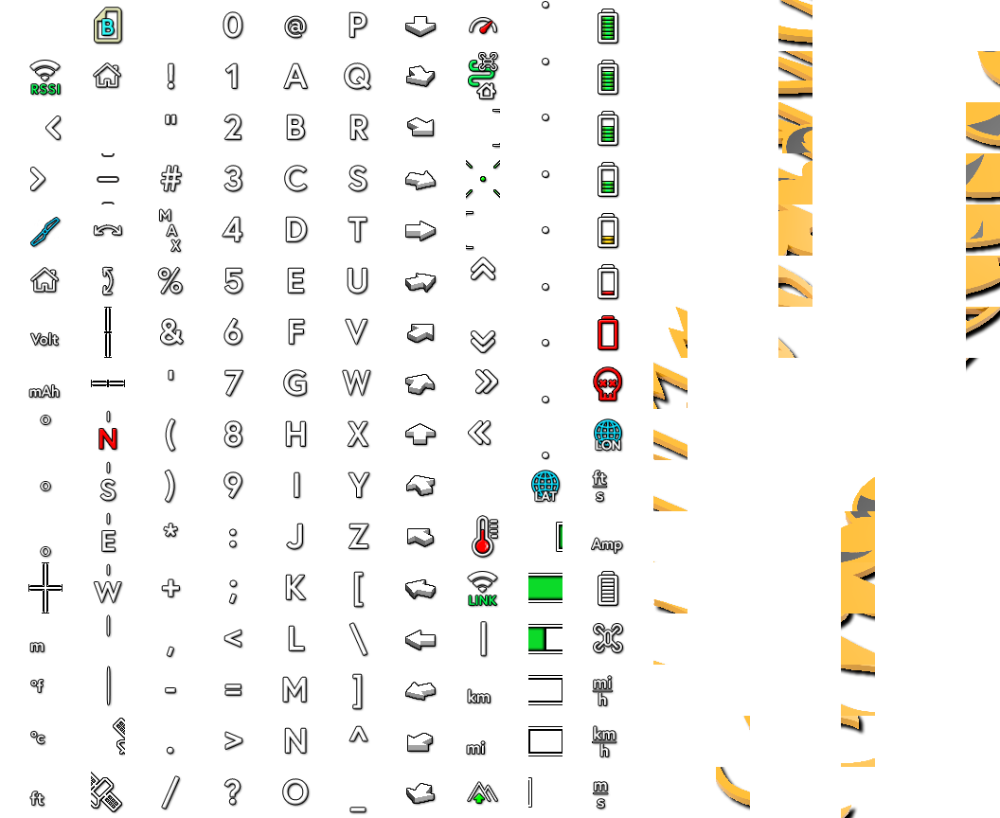
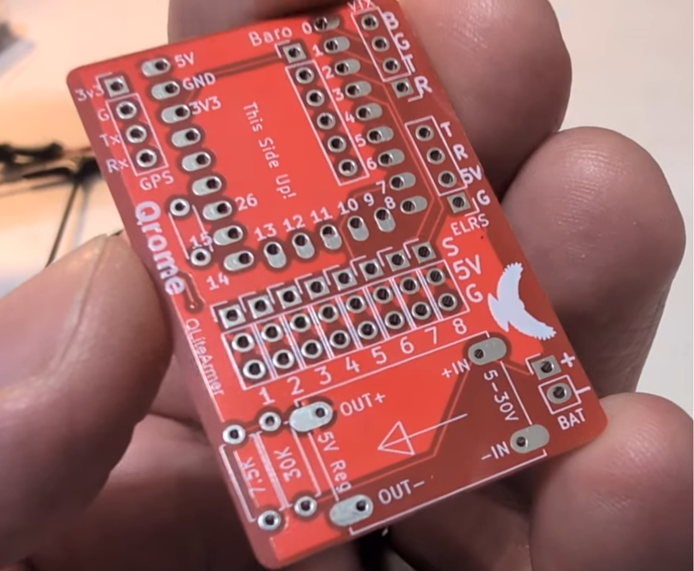
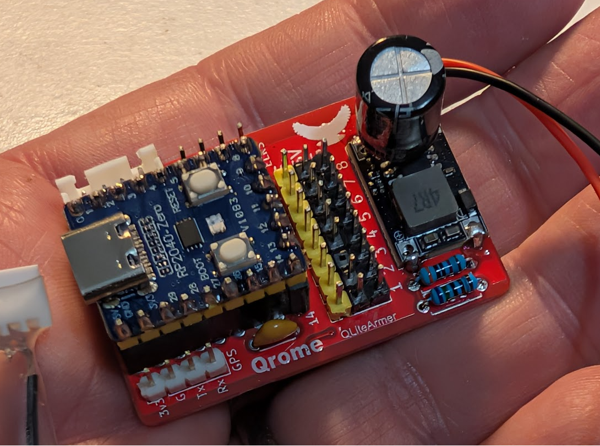

# QLiteArmer — Dual‑Core RP2040/RP2350 Telemetry Processor & Full MSP DisplayPort OSD

QLiteArmer is a high‑reliability, dual‑core RP2040‑based telemetry and OSD engine designed for FPV pilots, RC builders, and embedded developers.  
It provides:

- Full Betaflight‑style OSD for DJI O3/O4 and Walksnail Avatar HD  
- GPS + barometer telemetry processing  
- CRSF/ELRS channel breakout  
- PWM‑based arming (Channel 5)  
- 8‑channel servo expansion  
- Deterministic, non‑blocking architecture  

QLiteArmer is **not** an auto‑arming module — arming is **strictly controlled by RC PWM Channel 5** for safety and predictability.

---

## ✨ Features

### **Full OSD Engine (MSP DisplayPort)**
QLiteArmer includes a complete Betaflight‑compatible OSD renderer supporting:

- Satellite count  
- Pack voltage  
- Vertical speed  
- RC link quality (ELRS LQ)  
- Distance from home  
- Altitude  
- Ground speed  
- Total trip distance  
- Latitude / longitude  
- Home arrow (16‑direction)  
- Crosshair  

Compatible with:

- **DJI O3 / O4 Air Unit**
- **Walksnail Avatar HD (Goggles X / VTX)**

Uses Betaflight character mappings and custom glyphs for home arrow rendering.

---

## 🖼 Betaflight-Compatible Character Map (Walksnail Avatar HD)

This project includes a full custom character map matching Betaflight’s DisplayPort glyph layout, adapted for Walksnail Avatar HD.



---

## 🎮 PWM‑Based Arming (Channel 5)

Arming is now **100% PWM‑based**:

- Uses RC Channel 5 (default)
- Arms when PWM > threshold (default: 1700 µs)
- Disarms when PWM < threshold  

This ensures predictable, pilot‑controlled arming behavior.

---

## 🛰 Telemetry System

### **GPS Telemetry**
- Autodetects baud rate  (9600, 38400, 57600, 115200)
- Home position lock  
- Distance from home  
- Bearing to home  
- Ground speed  
- Latitude / longitude  
- Total trip distance  
- GPS fix + satellite count  

### **Barometer (BMP280)**
- Altitude (cm)  
- Vertical speed (cm/s)  

### **Battery Monitoring**
- VBAT via ADC  
- Configurable voltage divider  
- Pack voltage displayed in OSD  

### **Units**
- Metric or Imperial (configurable)

---

## 🧩 Servo Expansion (8‑Channel PWM Output)

QLiteArmer includes a hardware‑accurate servo expander:

- 8 PWM outputs  
- Per‑channel min/max mapping  
- Per‑channel failsafe values  
- Frequency‑matched output  
- CRSF/ELRS channel passthrough  
- Ultra‑stable RP2040 hardware PWM  

---

## ⚙ Pin Map

| Function | Pin(s) | Notes |
| --- | --- | --- |
| **CRSF / ELRS UART** | GP8 (TX), GP9 (RX) | Primary RC link |
| **MSP UART (VTX)** | GP0 (TX), GP1 (RX) | DJI / Walksnail |
| **I²C (BMP280)** | GP4 (SDA), GP5 (SCL) | Barometer |
| **VBAT ADC** | GP26 | Voltage divider |
| **PWM CH1–CH8** | 13, 12, 11, 10, 7, 6, 3, 2 | Servo/motor outputs |
| **RGB LED** | GP16 | Onboard WS2812 |
| **GPS** | GP14 (TX), GP15 (RX) | 4‑wire GPS |

---

## 🛠 Hardware Overview

### **QLiteArmer Custom PCB — Bare Board Available Soon**


### **QLiteArmer Custom PCB — Fully Assembled**


## 🧰 Parts List (with Affiliate Links)

These are the recommended components for building a complete QLiteArmer module.  
All links are affiliate links that help support the project at no additional cost.

### **Core Components**
- **QLiteAmer PCB Board by Qrome**  
  (Link Provided soon)

- **RP2040‑Zero**  
  https://amzn.to/4v0oCKq

- **BN‑220 GPS Module (9600 bps)**  
  https://amzn.to/4eTLu8G

- **HGLRC ExpressLRS 915 MHz Receiver**  
  https://amzn.to/4w56T5E

- **BMP280‑3.3 Atmospheric Pressure Sensor**  
  https://amzn.to/44y8Onq

### **Power & Regulation**
- **3A Mini DC‑DC Buck Converter (5.5–30 V → 5 V)**  
  https://amzn.to/4wcNi3h

### **Passive Components**
- **30 kΩ Resistor (¼ W)**  
  https://amzn.to/3StSnWB

- **7.5 kΩ Resistor (¼ W)**  
  https://amzn.to/440p8Nx

- **0.1 µF (100 nF) Ceramic Capacitors (104)**  
  https://amzn.to/4xO8TAQ

- **1000 µF 25 V Electrolytic Capacitor (optional)**  
  https://amzn.to/4vtyai8

### **Headers & Connectors**
- **Pin Header, 2.54mm 40Pin Male and Female Header Pins**  
  https://amzn.to/4oQfh6B

### **Other Recommended Items**
- **RADIOMASTER TX15 Max**  
  https://amzn.to/4vCAtQa

- **Walksnail Avatar HD FPV Goggles X**  
  https://amzn.to/4f2cXWN

- **Walksnail Avatar GT2 Kit – Air Unit**  
  https://amzn.to/4geaycN


---

## 🚀 How It Works (High‑Level)

1. **Boot**
   - System initializes dual‑core architecture  
   - LED indicates boot state  

2. **Telemetry Acquisition**
   - Core 1 handles GPS, barometer, battery, and OSD  
   - Core 0 handles CRSF/ELRS and PWM output  

3. **OSD Rendering**
   - MSP DisplayPort frames generated in real time  
   - Betaflight‑compatible glyphs  
   - Home arrow computed from GPS bearing  

4. **Arming**
   - PWM Channel 5 controls arming  
   - No auto‑arming logic  

5. **Servo Expansion**
   - CRSF channels mapped to PWM outputs  
   - Failsafe values applied on link loss  

---

## 🧠 System Architecture (Technical)

### **Core 0 (Time‑Critical)**
- CRSF/ELRS UART  
- PWM output generation  
- MSP heartbeat  
- Channel mapping  
- Failsafe handling  

### **Core 1 (Telemetry + OSD)**
- MSP DisplayPort  
- GPS parsing  
- Barometer updates  
- Battery ADC  
- OSD composition  
- State machine  
- LED driver  

### **SerialPIO Notes**
- SerialPIO is used for GPS  
- Requires careful initialization order  
- LED initialization must occur before SerialPIO  

### **RP2040 vs RP2350**
- Both fully supported  
- LED color order differs between boards  
- Auto‑detected via compile‑time selection  

---

## 🔧 Configuration Reference

### **PWM Channel Mapping**
Each channel has:
- `minUs`
- `maxUs`
- `failsafeUs`

Example (from config.h):
```
static const ChannelMap CH_MAP[8] = {
    {988, 2012, 1500},   // CH1
    {988, 2012, 1500},   // CH2
    {988, 2012, 1000},   // CH3 (Throttle failsafe = 1000)
    {988, 2012, 1500},   // CH4 
    {988, 2012, 1500},   // CH5
    {500, 2500, 1500},   // CH6 (expanded range)
    {988, 2012, 1500},   // CH7
    {988, 2012, 1500}    // CH8
};
```

### **Arming Settings**
- `PWM_ARM_CHANNEL = 4` (Channel 5 -- ZERO based mapping)  
- `PWM_ARM_THRESHOLD = 1700`  
- `PWM_NO_SIGNAL_US = 900`  

### **Battery Divider**
Default:
- R1 = 30k  
- R2 = 7.5k  

### **Telemetry Rates**
- Battery: 5 Hz  
- Altitude: 5 Hz  

### **Units**
- Metric or Imperial  

### **Timing**
- VTX detection timeout: 5 minutes  
- Heartbeat: 200 ms  

### **LED**
- LED pin: GP16  
- LED count: 1  
- RP2040/RP2350 color order handled internally  

### **Home Arrow Glyph Table**
Rows 96–111  
16 directions  
22.5° increments  
CCW orientation  

---

## 🧪 Tested Hardware

- RP2040‑Zero  
- RP2350-Zero  
- DJI O3 / O4 Air Unit  
- Walksnail Avatar HD  
- ELRS receivers  
- BMP280 barometer  
- Standard GPS modules  

---

## 📄 License

MIT License — free to modify, extend, and integrate.

